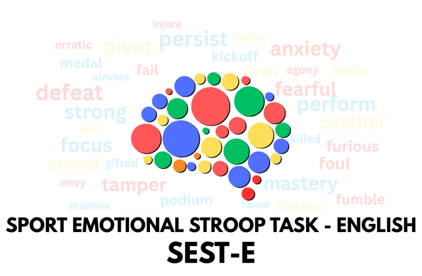
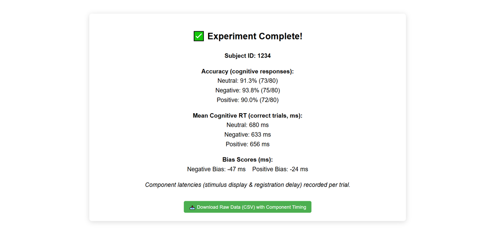

  

---

## Introduction

The Sport Emotional Stroop Task-English (SEST-E) is a specialized psychometric instrument designed to evaluate executive function — specifically inhibitory control and attentional regulation within athletic populations. In high-stakes competitive environments, an athlete's ability to suppress task-irrelevant stimuli is a prerequisite for maintaining focus on performance-critical variables. Traditional Stroop tasks often utilize generic lexical stimuli that lack ecological validity for the sporting domain. The SEST-E democratizes access to validated inhibitory control metrics by providing a platform-agnostic implementation that utilizes sport-specific emotional stimuli to capture the unique cognitive demands and internal affective states experienced by athletes.

The primary objective of the SEST-E is to quantify how the emotional valence of sport-related information (categorized as positive, negative, or neutral) modulates reaction time (RT) performance. By isolating the influence of these affective categories, the framework assesses the degree to which task-irrelevant emotional information captures attentional resources and interferes with goal-oriented cognitive processing. This understanding is foundational for developing targeted interventions aimed at preserving cognitive efficiency under psychological pressure. This strategic assessment of mental processing is achieved through a rigorous interaction between task architecture and controlled stimulus integration.

---

## Task Architecture and Stimulus Integration

To ensure that reaction time data reflects affective interference rather than linguistic processing difficulty, the SEST-E employs a strict lexical standardization of stimuli. Candidate words were controlled for character length, usage frequency, and syllable count. By ensuring these lexical characteristics are matched across valence categories, the task ensures that any observed RT variances are attributed solely to the emotional content of the stimuli, maintaining the internal validity of the experimental design.

The task architecture utilizes a stimulus-response mapping where participants must identify the font color (task-relevant) of a sport-related word while inhibiting the processing of the word's semantic meaning (task-irrelevant). To stabilize performance and minimize learning effects during the experimental blocks, the protocol begins with a **practice block of 20 trials**, allowing participants to internalize the color-to-key mapping before data recording commences.

### Response Key Mapping

| Keyboard Key | Corresponding Target Color |
|:---:|:---:|
| D | Red |
| F | Green |
| J | Blue |
| K | Yellow |

By isolating these reaction time variances through a controlled stimulus set and standardized mapping, we can derive specific behavioral metrics that reveal the underlying cognitive architecture of the athlete.

---

## Behavioral Metrics: Attentional Distraction and Traction

The SEST-E measures the "Emotional Stroop Effect," utilizing reaction time as a high-resolution proxy for cognitive load and attentional interference. Behavioral findings from the 2025 validation study indicate that emotional valence does not merely distract; it uniquely modulates the speed of inhibitory control through two distinct mechanisms:

- **Negative Stimuli (Attentional Distraction):** Negative sport-related words elicit significantly longer reaction times. This supports the Negativity Bias and the Valence Hypothesis, suggesting that threat-related information (e.g., fear of failure, injury) captures prioritized attentional resources, thereby increasing interference with task-relevant color identification.

- **Positive Stimuli (Attentional Traction):** Conversely, positive sports words have been shown to facilitate shorter reaction times compared to neutral stimuli. This phenomenon of "attentional traction" suggests that positive stimuli may enhance cognitive efficiency. Aligning with Mood-as-Information theory, the findings suggest that positive valence may encourage heuristic processing or benefit from integral affect, where the alignment between the stimulus valence and the task context facilitates more efficient cognitive performance.

> **Expert Caveat on Statistical Magnitude:** While the observed RT differences are often in the order of milliseconds, a Research Scientist must recognize that such variances are statistically and practically significant in the millisecond-critical environment of elite sports, where the margin between victory and defeat is frequently determined by such granular differences in processing speed. These findings underscore the necessity of validated, cross-linguistic tools in modern sports psychology.

### Example Output

Upon session completion, the task displays a summary of results and provides a CSV download of raw trial-level data:

  

---

## Linguistic Evolution and Development Context

The strategic necessity for cross-linguistic validation is paramount in establishing the global reliability of cognitive metrics. Validated tools for assessing an athlete's processing of emotional information have historically been scarce in English-speaking populations, creating a gap in our ability to compare executive function data across international cohorts.

The SEST-E serves as the direct English-language successor to the validated German-language instrument developed by Lautenbach et al. (2016). By adapting and validating this framework for English speakers, researchers have provided a standardized tool that allows for the robust study of inhibitory control under sport-specific conditions. This evolution from its academic development to its current technical implementation ensures that researchers have access to a tool that is both theoretically sound and technically accessible.

---

## Technical Implementation and Repository Contents

This repository provides a browser-based, open-source version of the SEST-E to enhance research accessibility and reproducibility across the scientific community. By offering a platform-agnostic implementation, this repository ensures that researchers can deploy validated experimental tasks without the constraints of proprietary software.

- **Technical Heritage:** While originally developed for the Millisecond online experiment platform (Inquisit Web), this HTML version is engineered to replicate the original experimental performance exactly. To maintain the integrity of the original design, the task adheres to millisecond-precision timing protocols, including a 500ms fixation cross and a 400ms feedback loop (a blank screen for correct responses or a red "X" for errors).

- **Local Execution and Data Integrity:** The task executes locally within the web browser, eliminating the need for server-side infrastructure. Upon completion of the session, the task generates a raw data output in CSV format, which can be saved directly to the user's machine. This provides researchers with immediate access to trial-level RT and accuracy data, formatted for seamless integration into statistical analysis pipelines.

This technical architecture ensures that data collection remains consistent with the formal requirements for publication in the open-science community.

---

## Citation and Primary Resource

Proper attribution is essential for the continued evolution of open-source scientific tools. Users of this implementation are required to cite the primary research article, which provides the full theoretical context, stimulus selection methodology, and statistical validation of the SEST-E.

### How to Cite

Lautenbach, F., O'Connor, E. J., Crozier, A. J., Murphy, A. P., & Immink, M. A. (2025). Attention distraction and traction by task-irrelevant emotion information in Athletes: Evidence from the Sport Emotional Stroop Task-English. *Psychology of Sport & Exercise, 80*, 102913. https://doi.org/10.1016/j.psychsport.2025.102913
